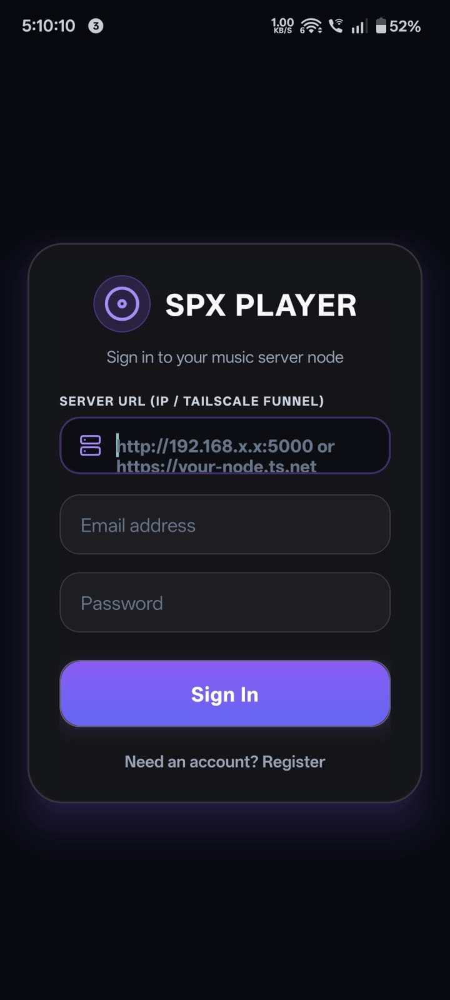
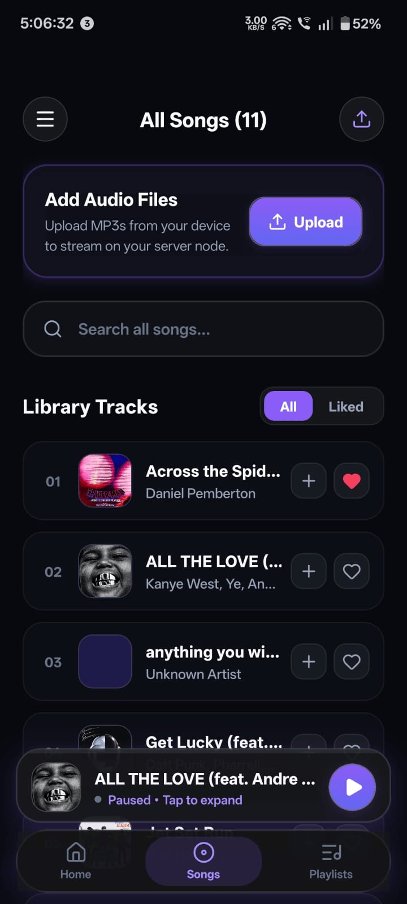
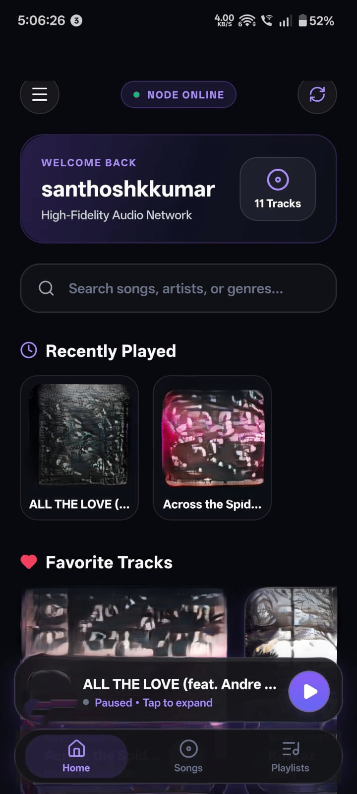
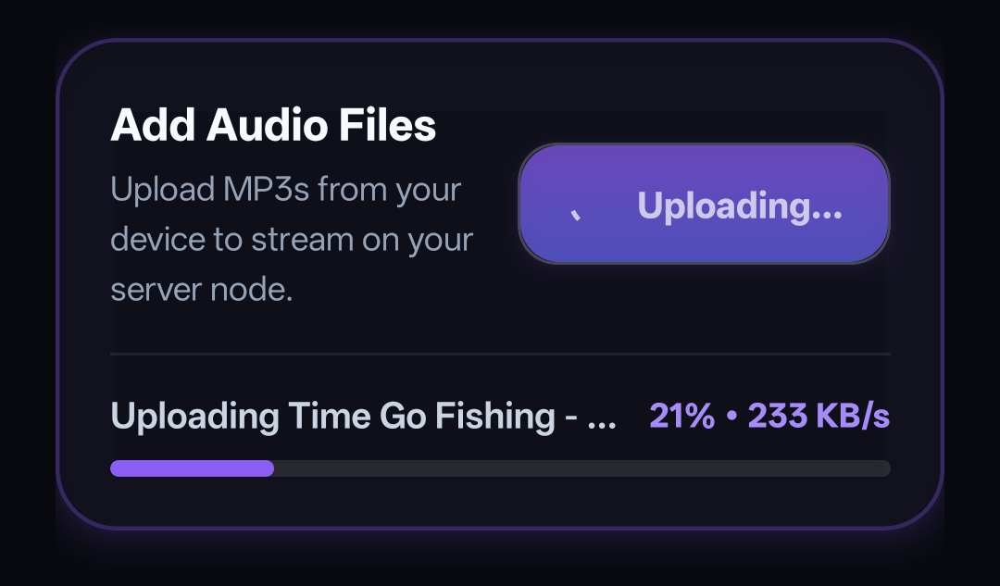

# Pulse Player 🎵

**SPX-Player**  is a self-hosted music streaming platform. Your music lives on a server you own, an old laptop in my case, and an Android app streams, uploads, and downloads it from anywhere over a private Tailscale network. No subscription, no cloud bill.

> **About this project:** I designed the backend, API, security model, and homelab infrastructure myself. The mobile UI was built with AI assistance (vibe-coded) so I could spend my time on the parts I wanted to learn: authentication, streaming, and self-hosting.

<!-- Add screenshots to docs/images/ and keep these paths -->
| Login | Library | Player | Upload |
| :---: | :---: | :---: | :---: |
|  |  |  |  |

---

## Features

- 🎧 **Streaming with seek support:** HTTP range requests (`206 Partial Content`), so seeking is instant.
- 📤 **Uploads (admin):** MP3, AAC, FLAC, M4A, OGG/OGA, WAV up to 100 MB, validated by extension, MIME type, and size.
- 🖼️ **Metadata and cover art:** ID3 tags and embedded artwork are extracted with `music-metadata`.
- 📑 **Playlists and likes:** stored per user in SQLite.
- 🔐 **Real authentication:** JWT access tokens, rotating refresh tokens, revocable sessions, bcrypt password hashing, and admin/user roles.
- 🔒 **Signed media URLs:** audio and cover requests use short-lived scoped tokens instead of permanent public links.
- 🔎 **Search, mini player, and full player screen** with portrait and landscape layouts.
- 🔁 **Switchable server URL:** change the backend address in-app (LAN, Tailscale, or public domain).
- ☁️ **Two storage modes:** local `music/` folder by default, or Cloudinary when credentials are set.

---

## Architecture

```text
┌──────────────────────┐        Tailscale (WireGuard)        ┌──────────────────────────────┐
│  Android phone       │ ──────────────────────────────────► │  Ubuntu Server (old laptop)  │
│  SPX-Player app    │   or home Wi-Fi / LAN               │                              │
│  Expo + React Native │                                     │  Node.js + Express  :3000    │
└──────────────────────┘                                     │    ├── SQLite (users, sessions,
                                                             │    │           playlists, likes)
                                                             │    └── music/  or  Cloudinary │
                                                             └──────────────────────────────┘
```

## Tech stack

| Layer | Technology |
| :--- | :--- |
| Mobile app | Expo SDK 57, React Native 0.86, React 19, `expo-audio`, Expo Secure Store, AsyncStorage |
| Backend | Node.js 22+, Express 5, built-in `node:sqlite`, JWT, bcryptjs, Multer, music-metadata |
| Hardening | Helmet, CORS allow-list, `express-rate-limit`, request size limits, path-traversal checks |
| Storage | Local filesystem or Cloudinary (audio is stored as Cloudinary `video` resources) |
| Infra | Ubuntu Server, SSH, Tailscale, EAS Build (Android APK) |

---

## Homelab setup

This is how the server side is set up. The app works the same on any machine that can run Node.js.

1. **Install Ubuntu Server** on the old laptop and enable OpenSSH during setup.
2. **Manage it over SSH** from your main machine: `ssh <user>@<server-lan-ip>`.
3. **Reserve a fixed LAN IP** for the server in your router (DHCP reservation) so the address never changes.
4. **Keep it running with the lid closed:** in `/etc/systemd/logind.conf` set `HandleLidSwitch=ignore`, then `sudo systemctl restart systemd-logind`.
5. **Install Node.js 22 or newer and git**, then follow *Backend setup* below.
6. **Install Tailscale** on the server and on your phone:
   ```bash
   curl -fsSL https://tailscale.com/install.sh | sh
   sudo tailscale up
   ```
7. In the app, set the **Server URL** to `http://<tailscale-ip-or-magicdns-name>:3000`.

Tailscale encrypts the traffic between your devices, and no router port-forwarding is needed.

---

## Backend setup (`spx-bend`)

```bash
cd spx-bend
npm install
cp .env.example .env      # then edit .env
npm start                 # listens on 0.0.0.0:3000
curl http://localhost:3000/health
```

Generate strong secrets (required in production, at least 32 characters each):

```bash
node -e "console.log(require('crypto').randomBytes(48).toString('hex'))"
```

Create the first admin (only admins can upload):

```bash
# set FIRST_ADMIN_USERNAME / FIRST_ADMIN_EMAIL / FIRST_ADMIN_PASSWORD in .env
npm run create-admin

# or promote an existing user
npm run make-admin -- <username>
```

### Environment variables

| Variable | Purpose |
| :--- | :--- |
| `NODE_ENV` | `production` or `development` |
| `PORT` | Server port (default `3000`) |
| `DATABASE_PATH` | SQLite file (default `./data/player.db`) |
| `JWT_ACCESS_SECRET`, `JWT_REFRESH_SECRET` | Two different secrets, 32+ characters |
| `ACCESS_TOKEN_TTL`, `REFRESH_TOKEN_TTL_DAYS`, `MEDIA_TOKEN_TTL` | Token lifetimes (`15m`, `30`, `15m`) |
| `CORS_ORIGIN` | Allowed origins, comma-separated (`*` allows any) |
| `CLOUDINARY_CLOUD_NAME`, `CLOUDINARY_API_KEY`, `CLOUDINARY_API_SECRET`, `CLOUDINARY_AUDIO_FOLDER` | Optional. Setting all three credentials switches storage to Cloudinary |
| `FIRST_ADMIN_USERNAME`, `FIRST_ADMIN_EMAIL`, `FIRST_ADMIN_PASSWORD` | Used only by `create-admin` |

`GET /health` reports the active storage mode (`local` or `cloudinary`).

## App setup (`spx-fron`)

```bash
cd spx-fron
npm install
cp .env.example .env      # EXPO_PUBLIC_BACKEND_URL=http://<server-address>:3000
npm start
```

Scan the QR code with Expo Go for development, or build a standalone APK:

```bash
eas build --platform android --profile preview
```

> **Keep the `spx-fron/android/` folder.** EAS uses the native project when it exists, so the native config and `app.config.js` must stay consistent.

---

## API

| Method | Endpoint | Access | Description |
| :--- | :--- | :--- | :--- |
| `GET` | `/health` | Public | Status and storage mode |
| `POST` | `/auth/register` | Public | Create an account |
| `POST` | `/auth/login` | Public | Returns access and refresh tokens |
| `POST` | `/auth/refresh` | Public | Rotate the refresh token |
| `POST` | `/auth/logout` | Auth | Revoke the session |
| `GET` | `/auth/me` | Auth | Current user |
| `GET` | `/songs` | Auth | List the library |
| `POST` | `/library/resync` | Auth | Rescan the library |
| `POST` | `/upload` | Admin | Upload a track (`multipart/form-data`, field `song`) |
| `GET` | `/stream/:song` | Media token | Range-enabled audio stream |
| `GET` | `/cover/:song` | Media token | Embedded cover art |
| `GET` | `/download/:song` | Media token | Download a track (local storage mode) |
| `GET/POST/PUT/DELETE` | `/playlists`, `/playlists/:id` | Auth | Manage your playlists |
| `GET/POST/DELETE` | `/likes`, `/likes/:songId` | Auth | Manage liked songs |

---

## Security notes

- Passwords are hashed with bcrypt (12 rounds). Refresh tokens are stored hashed, rotated on use, and revocable.
- Auth routes are rate limited (20 attempts per 15 minutes). JSON bodies are capped at 100 KB.
- Song paths are validated against the music directory to block path traversal.
- Secrets live only in the server's `.env`, which is never committed. The app only knows the server URL.
- The Android build allows plain HTTP so it can reach a LAN or Tailscale address. Tailscale encrypts that traffic. For a public deployment, put the API behind HTTPS.

## Repository structure

```text
├── spx-fron/          # Expo / React Native app (components, hooks, screens, plugins)
├── spx-bend/          # Express API (server/, music/, .env.example, API.md)
├── README.md
├── project.md         # Architecture and developer notes
├── DEPLOYMENT.md      # Cloudinary and Render deployment notes
└── render.yaml
```

## Roadmap

- [ ] Verify Cloudinary storage end to end with real credentials
- [ ] Public HTTPS API through a Cloudflare Tunnel
- [ ] Production Android build (AAB)
- [ ] Automated tests for the backend

## License

Personal project. A license will be added before wider release.